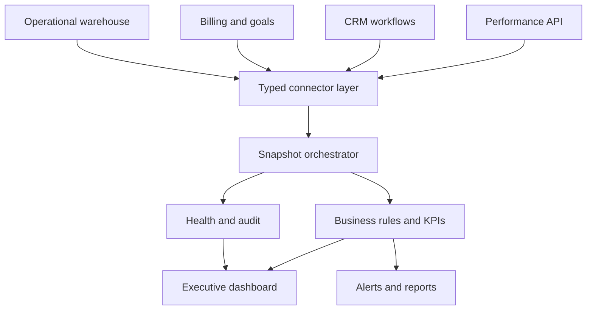

# Adtex — Executive Operations Platform

An AI-ready command center that unifies revenue, finance, sales, and system health across fragmented business platforms.

Adtex was designed around a common operational failure: leadership relies on several systems, but no single system explains what is happening, whether the data is current, or where intervention is required. The platform converts disconnected operational data into one decision layer—with source health, business rules, and recovery workflows built in.

> **Portfolio edition:** This is a clean-room implementation using fictional companies, synthetic metrics, mock connectors, and no production history. It contains no credentials, customer information, private endpoints, or employer source code.

## Why this project matters

This is not only a dashboard. The difficult work is behind the interface:

- reconciling sources with different schemas and update cadences;
- making stale or partial data visible to decision-makers;
- converting raw platform events into meaningful business KPIs;
- recovering missing periods without duplicating valid records;
- keeping financial, commercial, and operational definitions consistent;
- delivering a system that business teams can understand and trust.

## Product capabilities

### Executive decision layer

- Revenue, cost, profit, margin, and goal attainment
- Collections and billing visibility
- CRM funnel conversion from lead through won
- Partner-level performance and trend analysis
- P&L-ready normalized views
- Cross-company and time-period filtering

### Multi-system integration architecture

- Performance and monetization API adapter
- Monday.com CRM workflow adapter
- Google Sheets billing and planning adapter
- Supabase operational data layer
- Vercel scheduled-job orchestration
- Browser-based session refresh pattern for legacy systems
- Web Push notification delivery pattern
- Canonical typed model shielding the UI from provider schemas
- Concurrent source orchestration with independent health reporting

### Integration map

| System | Operational responsibility | Portfolio representation |
|---|---|---|
| Performance API | Daily revenue, cost, profit and partner-pair performance | Typed contract + deterministic adapter |
| Monday.com | Leads, deals, workflow stages and activity | CRM contract + synthetic funnel |
| Google Sheets | Billing, goals, collections and P&L inputs | Finance contract + fictional ledger values |
| Supabase | Snapshots, cached views, audit history and access controls | Warehouse contract + architecture documentation |
| Vercel Cron | Recurring sync, hourly snapshots, health verification and recovery | Orchestration design + CI-ready application |
| Web Push | Threshold alerts, sync failures and management updates | Alert rules + documented delivery boundary |
| Browser automation | Session renewal for a legacy source without a stable auth API | Security-isolated integration pattern |

### Reliability and operations

- Scheduled synchronization and hourly snapshots
- Idempotent reconciliation and targeted backfills
- Audit comparison between source and stored totals
- Self-healing flow for missing or inconsistent periods
- Retry, timeout, and graceful-degradation patterns
- Sync freshness, latency, record-count, and failure monitoring
- Threshold-driven alerts and push-notification architecture
- Weekly executive reporting pipeline

## Architecture



See [the architecture notes](docs/ARCHITECTURE.md) and [integration map](docs/INTEGRATIONS.md) for the system boundaries, production patterns represented, and key design decisions.

## Demo experience

The included application is a working, responsive executive dashboard powered entirely by deterministic synthetic data. It demonstrates:

- an executive KPI layer;
- revenue-versus-goal visualization;
- funnel conversion;
- partner economics;
- operating alerts;
- integration freshness and health.

The demo is safe to run locally and requires no external accounts.

## Quick start

### Requirements

- Node.js 22+
- npm 10+

```bash
git clone https://github.com/avivgur/adtex-management-platform.git
cd adtex-management-platform
npm install
npm run dev
```

Open [http://localhost:3000](http://localhost:3000).

The normalized snapshot is also available from `GET /api/dashboard`.

## Quality checks

```bash
npm run lint
npm run typecheck
npm test
npm run build
```

GitHub Actions runs all four checks for every pull request.

## Repository structure

```text
src/app/                    Next.js interface and demo API
src/lib/connectors/         Provider-independent connector contracts
src/lib/data/               Fictional deterministic demo data
src/lib/domain.ts           Canonical executive data model
src/lib/metrics.ts          Testable KPI and alert rules
src/lib/orchestrator.ts     Concurrent multi-source orchestration
tests/                      Domain and orchestration tests
docs/ARCHITECTURE.md        Architecture and production design patterns
SECURITY.md                 Public portfolio boundary and controls
```

## Technology

Next.js · React · TypeScript · Server Components · REST · Supabase-ready architecture · Vitest · GitHub Actions · Vercel-ready deployment

## What this demonstrates

Adtex reflects how I approach technology and operations:

1. Start with the decisions people need to make.
2. Map the systems, ownership, definitions, and failure modes behind those decisions.
3. Create a stable model across fragmented tools.
4. Automate collection while preserving visibility and control.
5. Build operational trust through monitoring, auditability, and recovery.

The result is a bridge between business operations, product thinking, systems architecture, and deployment—not simply a collection of integrations.

## Privacy

All names and values in this repository are fictional. See [SECURITY.md](SECURITY.md) for the explicit boundary between this public portfolio edition and any real operational environment.
