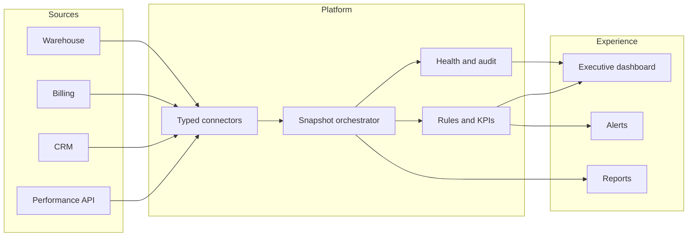

# Architecture

Adtex separates provider-specific access from business logic and presentation. The portfolio edition uses deterministic synthetic connectors, while preserving the seams required for real server-side integrations.

## Production architecture represented

The original operational problem required independent cadences and failure handling across multiple sources. The public edition models that design without exposing provider details:

- **Performance ingestion:** revenue, cost, profit, daily totals, and partner-pair performance
- **CRM ingestion:** leads, qualification, operations approval, negotiation, and won stages
- **Billing ingestion:** budget, goals, invoicing, collections, and P&L inputs
- **Warehouse:** normalized snapshots, historical comparisons, and cached views
- **Orchestration:** scheduled sync, idempotent upserts, backfills, and source-specific retries
- **Observability:** freshness, latency, record counts, consecutive failures, and operational alerts
- **Recovery:** audit comparisons and targeted self-healing for missing periods
- **Delivery:** responsive executive views, push-ready alerts, and periodic management reporting

## Design decisions

### One canonical model

The UI consumes an `ExecutiveSnapshot`; it does not understand provider payloads. This prevents a CRM or billing schema change from spreading across the application.

### Independent connectors

Each connector owns retrieval and health reporting. A delayed source remains visible rather than silently making the entire dashboard appear current.

### Derived metrics are pure functions

Profit, margin, goal attainment, collection rate, funnel conversion, and alert rules are deterministic and testable outside the framework.

### Synthetic by construction

The public repository was created without the production repository's history. Demo data is fictional and provider implementations are intentionally absent.
